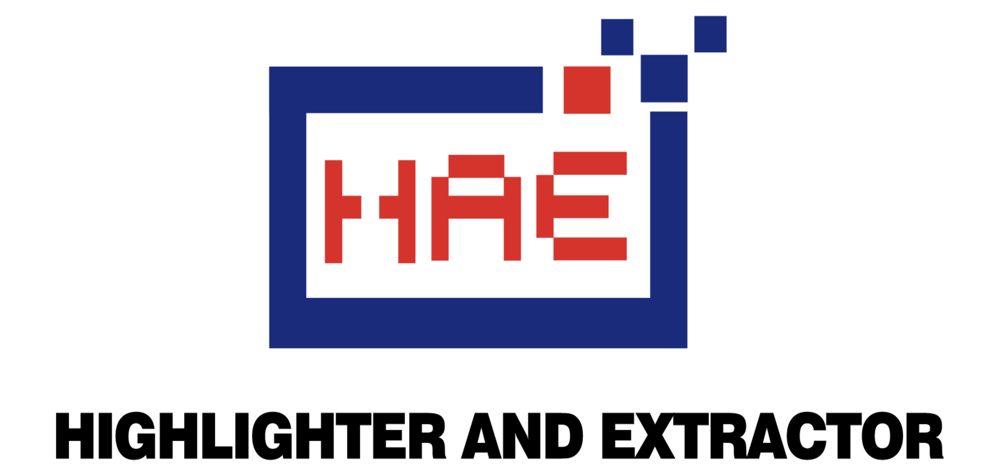

<h4><a href="https://github.com/gh0stkey/HaE">Empower ethical hacker for efficient operations.</a></h4>
<h5>Network version: <a href="https://github.com/gh0stkey/HaE/tree/main/src/HaENet">main/src/HaENet</a> File version: <a href="https://github.com/gh0stkey/HaE/tree/main/src/HaEFile">main/src/HaEFile</a>

README Version: \[[English](README.md) | [简体中文](README_CN.md)\]

## Project Introduction

**HaE** is a framework-style project in the field of **cybersecurity (data security)**, adopting a **Lego brick-style** modular design philosophy to achieve fine-grained tagging and extraction of File and HTTP messages (including WebSocket).

GitHub project address: https://github.com/gh0stkey/HaE

GitCode project address: https://gitcode.com/gh0stkey/HaE

**Awards and Recognitions**:

1. [Selected for the 2022 KCon Arsenal](https://mp.weixin.qq.com/s/JohMsl1WD29LHCHuLf8mVQ)
2. [Recognized as a GitCode G-Star Project](https://gitcode.com/gh0stkey/HaE)

## Appreciation List

It is precisely because of the strong support from the members of the sponsor list that HaE has been able to reach today: [Appreciation List](APPRECIATION_LIST.md)

## Support the Project

If you find HaE useful, you can show your appreciation by donating to the author, giving them the motivation to continue updating and improving it!

## 404StarLink 2.0 - Galaxy

`HaE` is part of the 404Team's [Starlink Plan 2.0](https://github.com/knownsec/404StarLink2.0-Galaxy). If you have any questions about `HaE` or want to connect with other users, you can refer to the group joining methods provided by the Starlink Plan.

- [https://github.com/knownsec/404StarLink2.0-Galaxy#community](https://github.com/knownsec/404StarLink2.0-Galaxy#community)
