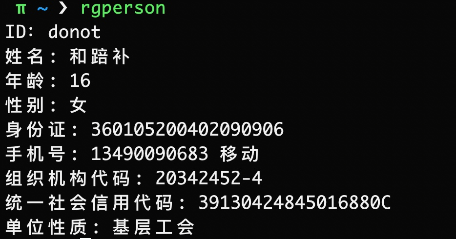
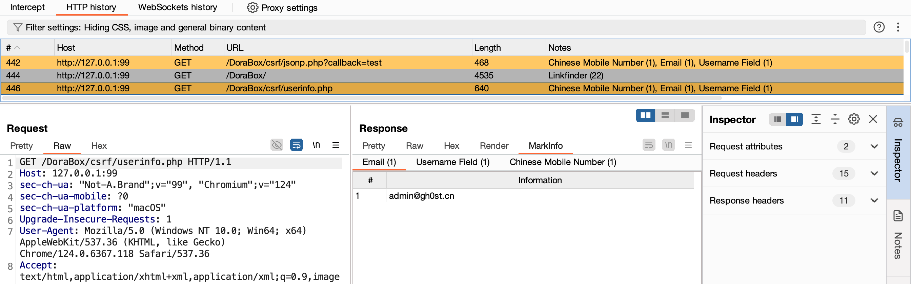

<h4><a href="https://gh0st.cn/HaE/">赋能白帽，高效作战！</a></h4>
<h5>第一作者： <a href="https://github.com/gh0stkey">EvilChen</a>（中孚信息元亨实验室）, 第二作者： <a href="https://github.com/0chencc">0chencc</a>（米斯特安全团队）</h5>

## 项目介绍

**HaE**是一个基于`BurpSuite Java插件API`开发的辅助型框架式插件，旨在实现对HTTP消息的高亮标记和信息提取。该插件通过自定义正则表达式匹配响应报文或请求报文，并对匹配成功的报文进行标记和提取。

随着现代化Web应用采用前后端分离的开发模式，日常漏洞挖掘的过程中，捕获的HTTP请求流量也相应增加。若想全面评估一个Web应用，会花费大量时间在无用的报文上。**HaE的出现旨在解决这类情况**，借助HaE，您能够**有效减少**测试时间，将更多精力集中在**有价值且有意义**的报文上，从而**提高漏洞挖掘效率**。

**注**: 要想灵活的使用`HaE`，你需要掌握正则表达式阅读、编写、修改能力；由于`Java`正则表达式的库并没有`Python`的优雅或方便，所以HaE要求使用者必须用`()`将所需提取的表达式内容包含；例如你要匹配一个**Shiro应用**的响应报文，正常匹配规则为`rememberMe=delete`，如果你要提取这段内容的话就需要变成`(rememberMe=delete)`。

## 使用方法

插件装载: `Extender - Extensions - Add - Select File - Next`

初次装载`HaE`会自动获取官方规则库`https://raw.githubusercontent.com/gh0stkey/HaE/gh-pages/Rules.yml`，配置文件（`Config.yml`）和规则文件（`Rules.yml`）会放在固定目录下：

1. Linux/Mac用户的配置文件目录：`~/.config/HaE/`
2. Windows用户的配置文件目录：`%USERPROFILE%/.config/HaE/`

除此之外，您也可以选择将配置文件存放在`HaE Jar包`的同级目录下的`/.config/HaE/`中，**以便于离线携带**。

## 优势特点

1. 精细配置：高度自由的配置选项，以满足各类精细化场景需求。
2. 分类标签：使用标签对规则进行分类，便于管理和组织规则。
3. 高亮标记：在HTTP History页面，通过颜色高亮和注释判断请求的价值。
4. 易读配置：使用易读的YAML格式存储配置文件，方便阅读和修改。
5. 数据集合：将匹配到的数据、请求和响应集中在数据面板中，提高测试和梳理效率。
6. 简洁可视：清晰可视的界面设计，更轻松地了解和配置HaE，操作简单、使用便捷。
7. 颜色升级：内置颜色升级算法，避免“屠龙者终成恶龙”场景，突出最具价值的请求。
8. 实战规则：官方规则库是基于实战化场景总结输出，提升数据发现的有效性、精准性。

| 界面名称                  | 界面展示                                              |
| ------------------------ | ---------------------------------------------------- |
| Rules（规则信息管理）     |      |
| Config（配置信息管理）    |     |
| Databoard（数据集合面板） |  |

## 实际使用

使用 RGPerson 生成测试数据，放入网站根目录文件中: 

访问该地址，在`Proxy - HTTP History`中可以看见高亮请求，响应标签页中含有`MarkInfo`标签，其中将匹配到的信息提取了出来。

## 文末随笔

正义感是一个不可丢失的东西。

如果你觉得HaE好用，可以打赏一下作者，给作者持续更新下去的动力！

## 404StarLink 2.0 - Galaxy

`HaE` 是 404Team [星链计划2.0](https://github.com/knownsec/404StarLink2.0-Galaxy) 中的一环，如果对 `HaE` 有任何疑问又或是想要找小伙伴交流，可以参考星链计划的加群方式。

- [https://github.com/knownsec/404StarLink2.0-Galaxy#community](https://github.com/knownsec/404StarLink2.0-Galaxy#community)
