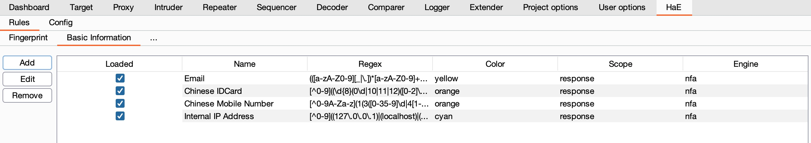
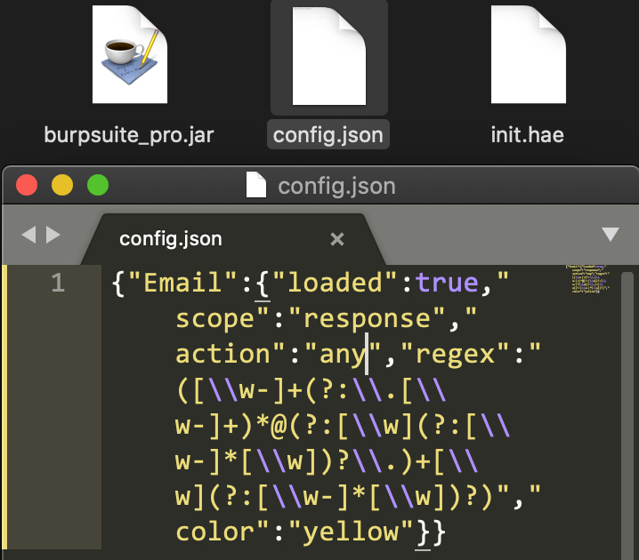
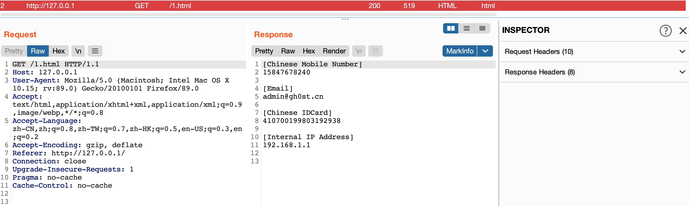

# HaE - Highlighter and Extractor

Note: My english is not very good, Thanks!

Read Chinese simplified version ([README_zh](README_zh.md)).

## Introduction

**HaE** is used to highlight HTTP requests and extract information from HTTP response messages.



The plugin can custom regular expression to match HTTP response messages. You can decide for yourself whether the corresponding request that meets the custom regular expression match needs to be highlighted and information extracted.

**Note**: The use of HaE requires a basic regular expression foundation for testers. Since the Java regular expression library is not as elegant or convenient as Python, when using regular expressions, HaE requires users to use `()` to extract what they need The expression content contains; for example, if you want to match a response message of a Shiro application, the normal matching rule is `rememberMe=delete`, if you want to extract this content, you need to become `(rememberMe=delete)`.

## Instructions

Load: `Extender - Extensions - Add - Select File - Next`

The configuration file is initialized when HaE is loaded for the first time. The default configuration file has a built-in regular expression: `Email`. The initialized configuration file will be placed in the same directory as the BurpSuite Jar package.



In addition to the initial configuration file, there is `init.hae`, which is used to store the configuration file path; `HaE` supports custom configuration file paths, and you can select a custom configuration file by clicking the `Select File` button.


HaE supports three actions:

1. Reload: It can be used when you do not use the HaE UI interface to modify the rules in the configuration file, but directly modify the rules based on the configuration file;
2. New: Add a new rule will automatically add a row of table data, click or double-click to modify the data to automatically save;
3. Delete: When you click to select a rule, press this button to delete the rule.

**Note**: `HaE's operations` are based on the form UI, and all operations will be automatically saved.

## Plugin Advantages

1. Multi-option custom adaptation requirements;
2. Multi-color classification (colors of BurpSuite): `red, orange, yellow, green, cyan, blue, pink, magenta, gray`;
3. Color upgrade algorithm: **Two regulars expression, the colors are both orange, if the request are matched these, it will be upgraded to red.**
4. The configuration file format uses JSON format, the format is
    ```
    {name: {"loaded": isLoaded,"regex": regexText, "highlight": isHighlight, "extract": isExtract, "color": colorText}}
    ```
5. Built-in simple cache to reduce the stuttering phenomenon in the `multi-regular, big data scenario`.

## Actual Use

Use RGPerson to generate test data and put it in the root directory file of the website:


Visit the address, you can see the highlighted request in the `Proxy-HTTP History`, and you can see the response tab contains the `MarkINFO` tag, which extracts the matched information.




## Regular Expression Optimization

Some regular expression are not ideal in actual combat application scenarios.

There will be some false positives when regular expression matching mobile phone numbers (pure numbers), the mobile phone number processing can be solved:

Original regular expression: 

```
1[3-9]\d{9}
```

False positive scenario: `12315188888888123`, it will match `15188888888`, but this paragraph is not a mobile phone number, so the modification rule is:

```
[^0-9]+(1[3-9]\d{9})[^0-9]+
```

The mobile phone number required to be matched cannot be a number from 0-9.


### Include Regular Expression List

Chinese ID-Number（From: https://github.com/gh0stkey/HaE/issues/3）: 

```
[^0-9]([1-9]\d{5}(18|19|([23]\d))\d{2}((0[1-9])|(10|11|12))(([0-2][1-9])|10|20|30|31)\d{3}[0-9Xx])|([1-9]\d{5}\d{2}((0[1-9])|(10|11|12))(([0-2][1-9])|10|20|30|31)\d{2}[0-9Xx])[^0-9]
```

Email Address: 

```
([\w-]+(?:\.[\w-]+)*@(?:[\w](?:[\w-]*[\w])?\.)+[\w](?:[\w-]*[\w])?)
```

