# HaE - 信息高亮与提取者

## 前言

HaE（Highlight and Extractor），是基于MarkINFO插件（地址：https://github.com/gh0stkey/BurpSuite-Extender-MarkInfo ）的基础进行重构。

用处：
- 高亮标记请求，针对高亮的请求进行深度挖掘
- 敏感信息泄露发现

## 设计想法

语言：Python

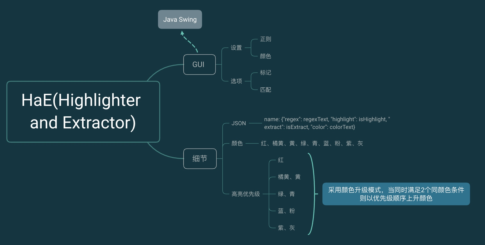

功能：
- 自定义正则
- 自定义高亮颜色
- 自定义高亮或提取

## 设计过程

### 可视化界面

UI设计（基于Eclipse可视化设计），基于Java Swing

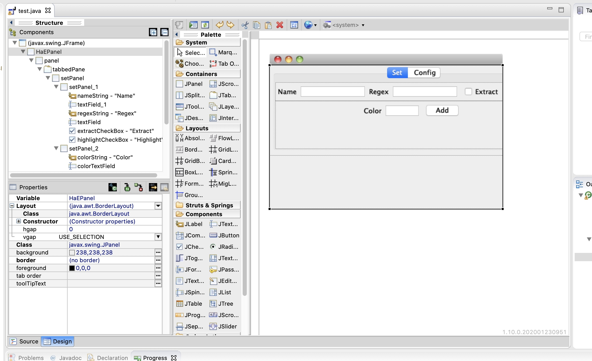

然后将Java代码转换为Python代码即可（**有很多坑～**）

使用BurpSuite接口：`ITab`创建Tab

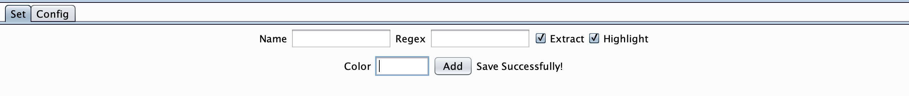

### 高亮颜色

将BurpSuite的所有高亮颜色集成：（仅支持：`red, orange, yellow, green, cyan, blue, pink, magenta, gray`）


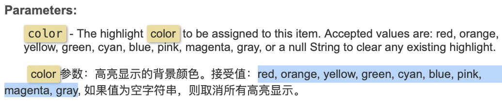

### 配置文件格式

选用JSON格式，格式为

```
name: {"regex": regexText, "highlight": isHighlight, "extract": isExtract, "color": colorText}
```

### 颜色优先级和升级

定义Colors变量：

`colors = ['red', 'orange', 'yellow', 'green', 'cyan', 'blue', 'pink', 'magenta', 'gray']`

利用下标的方式进行优先级排序，当满足2个同颜色条件则以优先级顺序上升颜色。（例如：**两个正则，颜色为橘黄色，该请求两个正则都匹配到了，那么将升级为红色**）

## 使用方法

贴一些案例，仅供参考，还有更多玩法，可以自我琢磨～

### 环境设置

进入Extender - Options - Python Environment

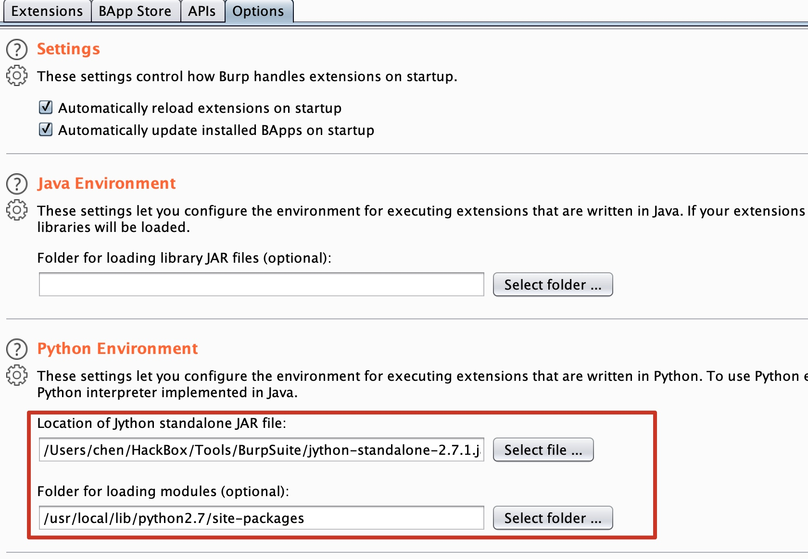

载入Jython的Jar包以及载入python的包路径。

加载插件，选择HaE.py文件：

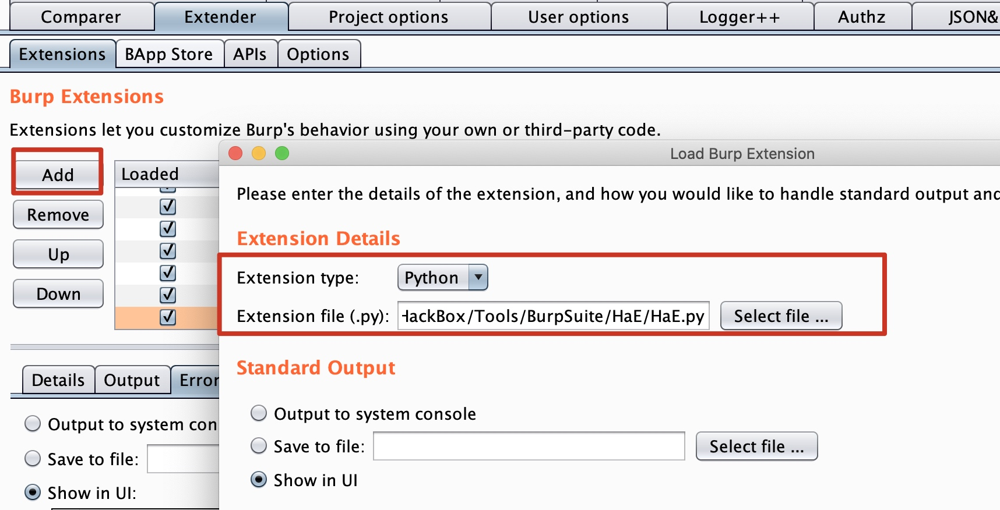

加载成功：

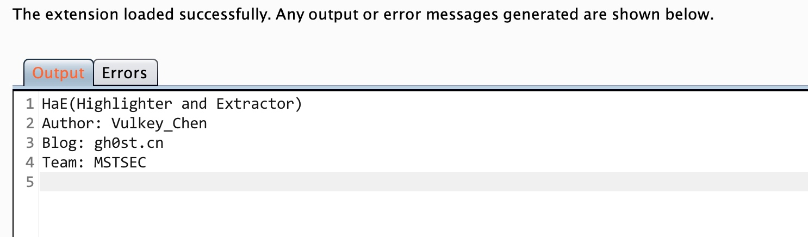


### RUN IT

#### 添加自定义正则

```
名字：Email

正则：[\\w-]+(?:\\.[\\w-]+)*@(?:[\\w](?:[\\w-]*[\\w])?\\.)+[\\w](?:[\\w-]*[\\w])?

高亮颜色：red

是否高亮和提取：是
```

转到HaE标签页，进行设置，点击Add按钮即可添加

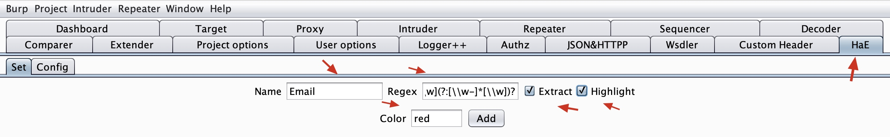

HaE - Config查看是否进行配置，点击Reload按钮：

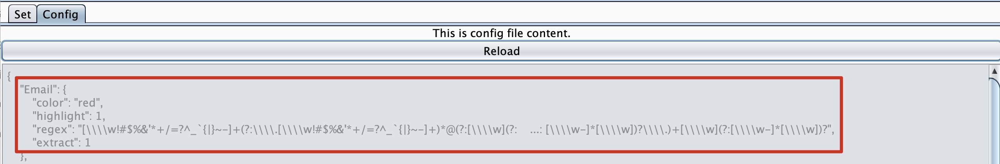

#### 高亮请求

在Proxy - HTTP History中可以看见高亮请求，响应标签页中含有`MarkINFO`标签，其中将匹配到的邮箱提取了出来

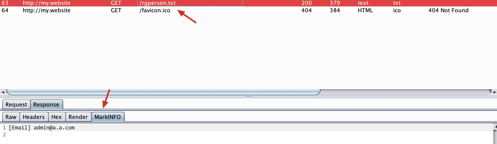

#### 正则优化（参考Demo）

在正则匹配手机号、身份证号码的时候（纯数字类）会存在一些误报（这里匹配身份证号码无法进行校验，误报率很高），但手机号处理这一块可以解决：

原正则：

```
(1[3-9]\d{9})
```

误报场景：`12315188888888123`，这时候会匹配到`15188888888`，而实际上这一段并不是手机号，所以完全可以修改正则为：

```
[^0-9]+(1[3-9]\d{9})[^0-9]+
```

也就是要求匹配的手机号前后不能为0-9的数字。

## 实战用法

### CMS指纹识别

例如：识别Discuz，名字：CMS-Discuz，正则：`Powered by Discuz!`，高亮颜色：blue

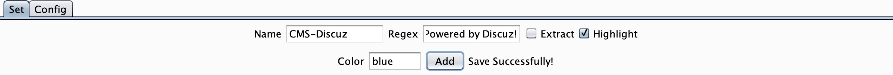

Add保存到配置文件中：

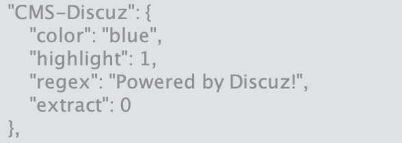

请求识别：

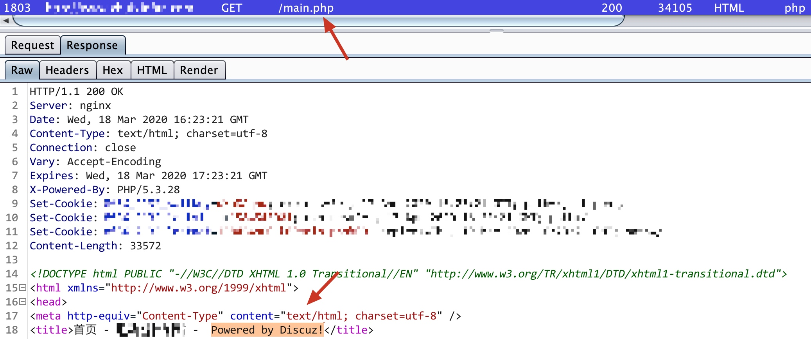

### OSS对象存储信息泄露

名字：INFO-OSS

正则：`[A|a]ccess[K|k]ey[I|i]d|[A|a]ccess[K|k]ey[S|s]ecret`

高亮颜色：cyan

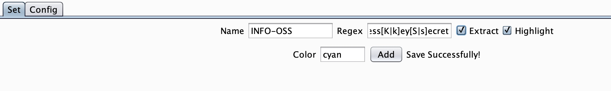

Add保存到配置文件中：

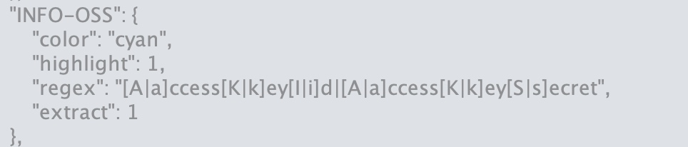

请求中识别并提取：

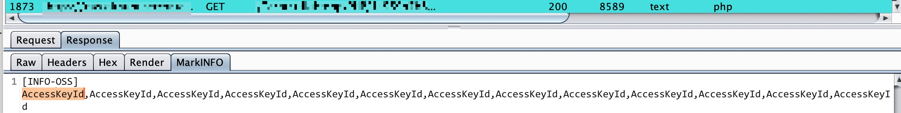
