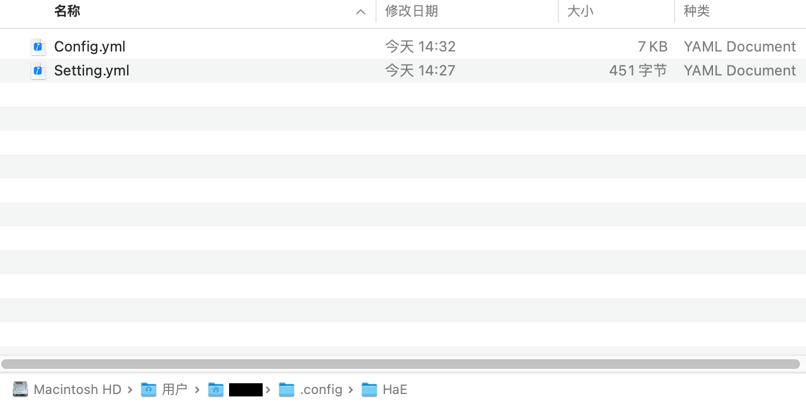
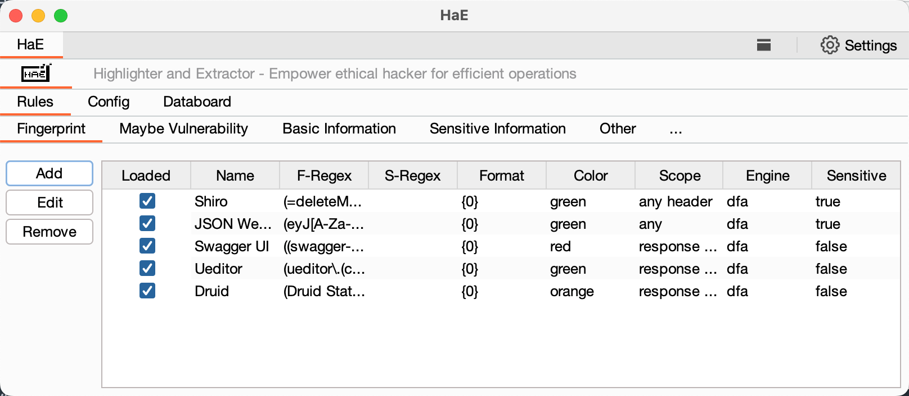
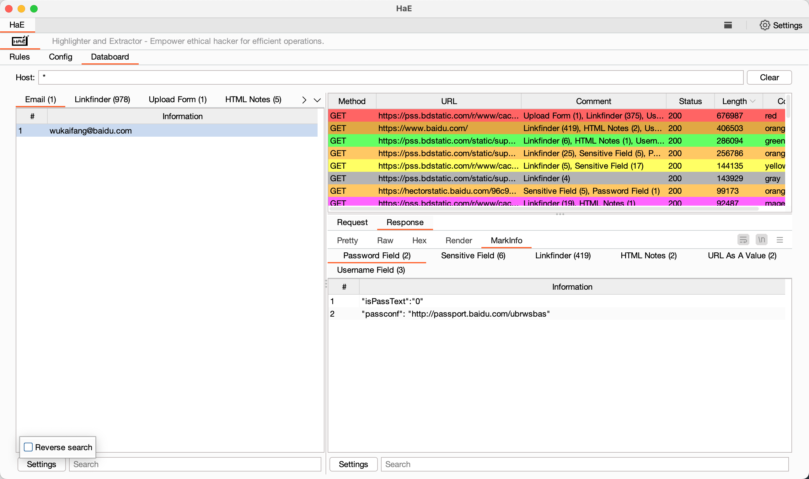
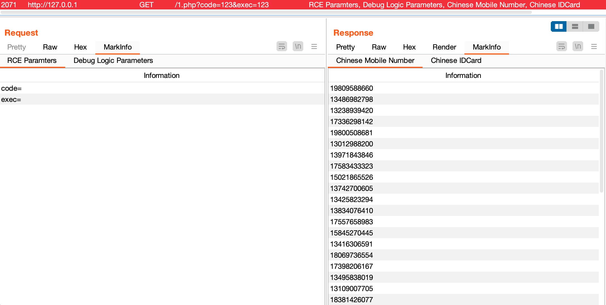

<h4><a href="https://gh0st.cn/HaE/">赋能白帽，高效作战！</a></h4>
<h5>第一作者： <a href="https://github.com/gh0stkey">EvilChen</a>（中孚信息元亨实验室）, 第二作者： <a href="https://github.com/0chencc">0chencc</a>（米斯特安全团队）</h5>

## 项目介绍

**HaE**是基于 `BurpSuite Java插件API` 开发的请求高亮标记与信息提取的辅助型框架式插件，该插件可以通过自定义正则的方式匹配响应报文或请求报文，并对满足正则匹配的报文进行信息高亮与提取。

现代化Web应用走上前后端分离开发模式，这就导致在日常测试时候会有许多的流量，如果你想要尽可能全面的对一个Web应用进行测试评估，将花费大量精力浪费在无用的报文上；**HaE的出现正是为了解决这一类似场景**，借助HaE你可以**有效的减少**测试的时间，将更多的精力放在**有价值、有意义**的报文上，**提高漏洞挖掘效率**。

**注**: 要想灵活的使用`HaE`，你需要掌握正则表达式阅读、编写、修改能力；由于`Java`正则表达式的库并没有`Python`的优雅或方便，所以HaE要求使用者必须用`()`将所需提取的表达式内容包含；例如你要匹配一个**Shiro应用**的响应报文，正常匹配规则为`rememberMe=delete`，如果你要提取这段内容的话就需要变成`(rememberMe=delete)`。

## 使用方法

插件装载: `Extender - Extensions - Add - Select File - Next`

初次装载`HaE`会初始化配置文件，默认配置文件内置一个正则: `Email`，初始化的配置文件会放在的`/用户根目录/.config/HaE/`目录下。

除了初始化的配置文件外，还有`Setting.yml`，该文件用于存储配置文件路径与排除后缀名；`HaE`支持自定义配置文件路径，你可以通过点击`Select File`按钮进行选择自定义配置文件。

## 优势特点

1. **精细化配置项**：高自由度配置更适配精细化场景需求；
2. **简洁可视界面**：简洁的可视化界面让你更加清晰了解HaE的各项配置，操作更轻松，使用更简单；
3. **颜色升级算法**：内置颜色升级算法，避免“屠龙者终成恶龙”场景，突出最具价值的请求；
4. **标签化规则项**：标签化你的正则规则，让规则可分类，让管理更轻松；
5. **数据集合面板**：将所有匹配数据集合到Databoard中，使得测试、梳理更高效；
6. **高亮标记一体**：在Proxy - History页面你可以通过颜色高亮与Comment判断请求价值；
7. **实战化官方库**：基于实战化场景、案例进行输出的官方规则库，提升测试实战性；
8. **配置文件易读**：配置文件使用YAML格式存储，更加便于阅读与修改。

| 界面名称                  | 界面展示                                              |
| ------------------------- | ----------------------------------------------------- |
| Rules（规则信息管理）     |      |
| Config（配置信息管理）    |     |
| Databoard（数据集合面板） |  |

## 实际使用

使用 RGPerson 生成测试数据，放入网站根目录文件中: 

访问该地址，在`Proxy - HTTP History`中可以看见高亮请求，响应标签页中含有`MarkINFO`标签，其中将匹配到的信息提取了出来。

## 文末随笔

正义感是一个不可丢失的东西。

如果你觉得HaE好用，可以打赏一下作者，给作者持续更新下去的动力！

## 404StarLink 2.0 - Galaxy

`HaE` 是 404Team [星链计划2.0](https://github.com/knownsec/404StarLink2.0-Galaxy) 中的一环，如果对 `HaE` 有任何疑问又或是想要找小伙伴交流，可以参考星链计划的加群方式。

- [https://github.com/knownsec/404StarLink2.0-Galaxy#community](https://github.com/knownsec/404StarLink2.0-Galaxy#community)
