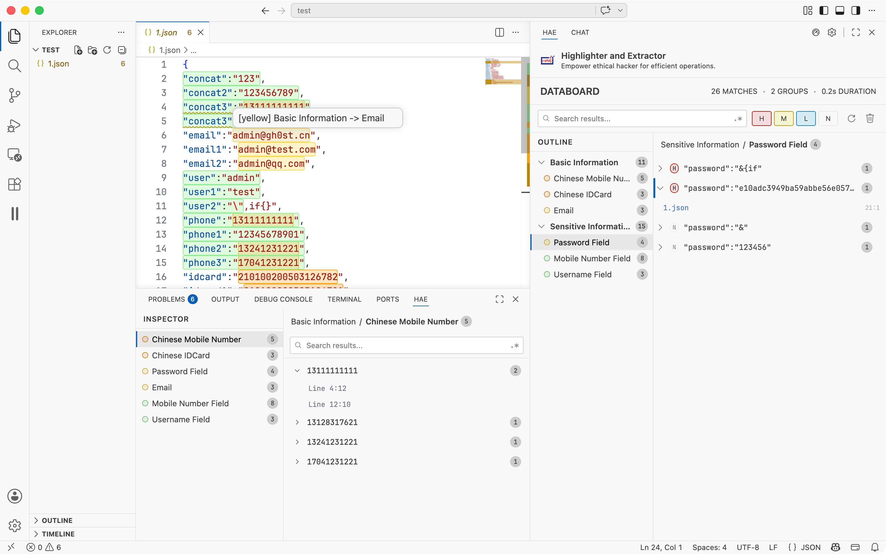

<h3>HaE File</h3>

README Version: \[[English](README.md) | [简体中文](README_CN.md)\]

## Project Introduction

By utilizing **regex engine** customized expressions, HaE File can accurately match and process file contents, effectively tagging and extracting information from successfully matched content. This enhances the **efficiency of vulnerability and data analysis** in the field of cybersecurity (data security).

> The volume of logs, configuration files, and source code that need to be processed during daily analysis is growing rapidly. Relying solely on traditional text tools for manual inspection often consumes significant effort on irrelevant content. **The emergence of HaE File aims to address such situations** — with HaE File, you can precisely filter out redundant information and focus more effort on content that matches key characteristics, thereby **improving the efficiency of vulnerability and data analysis**.

## Usage

1. Install the HaE extension in VS Code (`Extensions` -> `Install from VSIX...`).
2. Run scans via the right-click context menu or the HaE Databoard panel:
   - **Scan File** — Scan a specific file
   - **Scan Folder** — Scan a specific folder
   - **Scan Workspace** — Scan the entire workspace
3. Scan results will be displayed in the **Databoard** data panel in the sidebar. Click on a rule to view match details.
4. When a file is opened, the bottom **File Inspector** panel will display real-time match information for the current file.
5. Matched content in the editor is automatically highlighted (can be disabled in settings).

### Rule Definitions

Currently, HaE File rules consist of 6 fields, with detailed meanings as follows:

| Field     | Meaning                                                      |
| --------- | ------------------------------------------------------------ |
| Name      | Rule name, primarily used to briefly summarize the purpose of the current rule. |
| Regex     | Rule regex, mainly used for entering regular expressions. In HaE, any content that needs to be extracted and matched should be enclosed within `(` and `)`. |
| Color     | Match color, indicating the highlight color to mark when the current rule matches the corresponding file content. Supports colors such as red, orange, yellow, green, cyan, blue, pink, magenta, and gray. |
| Sensitive | Case sensitivity, indicating whether the current rule is case-sensitive. If sensitive (`True`), it strictly matches the case; if insensitive (`False`), it does not consider case differences. |
| Loaded    | Rule loading status, indicating whether the current rule is enabled and participates in scanning. |
| Validator | External validator for classifying matched data by severity (high/medium/low/none). Contains three sub-settings: **Command** — the validator command that receives match data via stdin (JSON) and returns severity results via stdout; **Timeout** — maximum wait time per execution in milliseconds (default: 5000); **Bulk** — number of matches sent per invocation (default: 500). |

## Key Features and Advantages

1. **Efficient Scanning**: Built on the **ripgrep** high-performance search engine, supporting multi-threaded concurrent scanning to quickly process massive files, easily handling large code repositories and log directories.
2. **Real-time Highlighting**: **Real-time highlight marking** of matched content in the editor, supporting multiple colors to distinguish different rules — see matches at a glance when opening files.
3. **Data Panel**: Scan results are **centralized in the Databoard data panel**, categorized by rules and groups, supporting one-click queries, filtering, and information extraction to improve analysis efficiency.
4. **File Inspection**: The bottom **File Inspector** panel displays real-time match details for the currently opened file, supporting search filtering and deduplication for in-depth analysis.
5. **Flexible Configuration**: Supports customizable scan timeout, file size limits, ignored extensions, concurrent thread count, and other parameters for **flexible on-demand adjustment**.
6. **External Validation**: Supports **external validators** for classifying match results by severity (high/medium/low/none), enabling automated risk rating.
7. **Practical Rules**: The official rule library is **based on real-world scenario summaries**, covering basic information, sensitive information, and other categories — ready to use out of the box.

