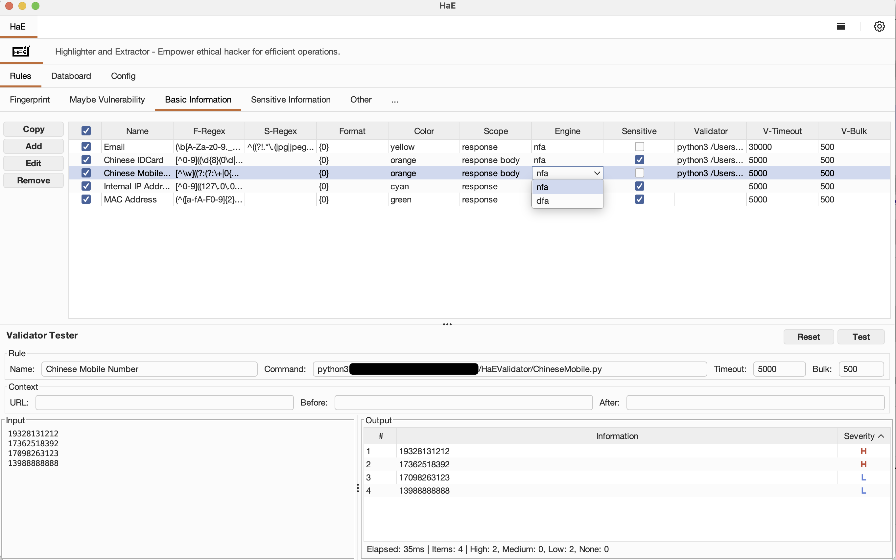
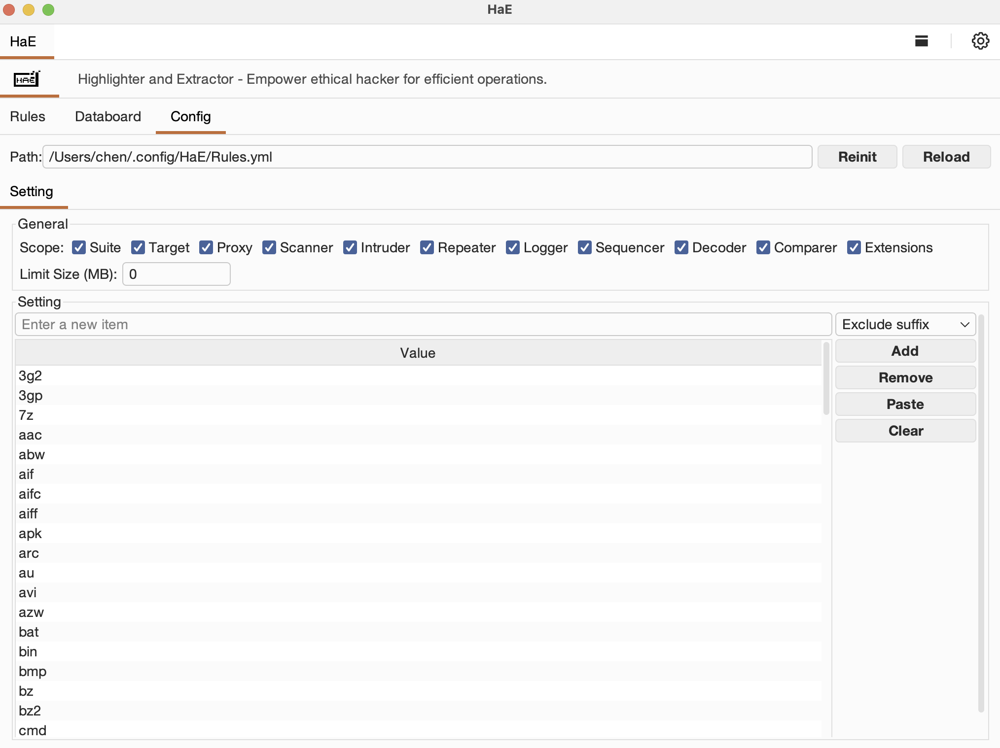
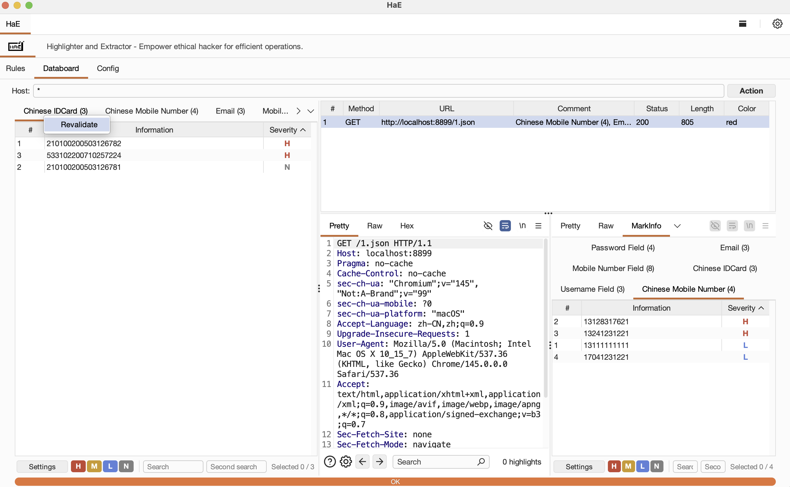
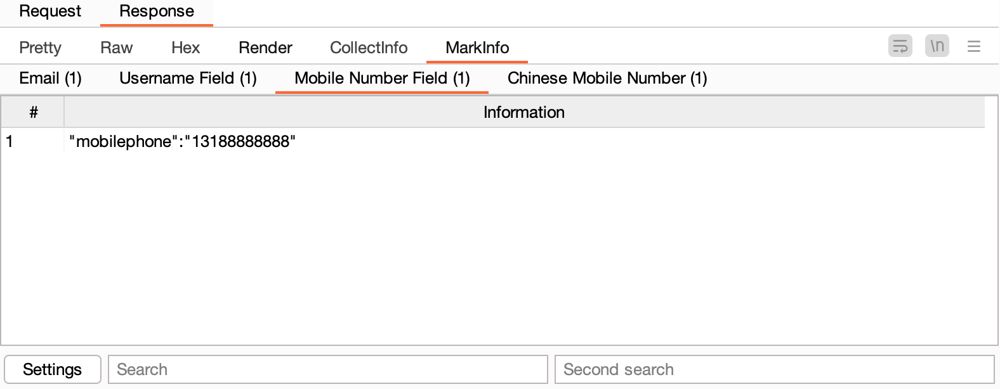

<h3>HaE Network</h3>
<h5>First Author: <a href="https://github.com/gh0stkey">EvilChen</a> Second Author: <a href="https://github.com/0chencc">0chencc</a>（Mystery Security Team） Third Author: <a href="https://github.com/vaycore">vaycore</a>（Independent Security Researcher）</h5>

README Version: \[[English](README.md) | [简体中文](README_CN.md)\]

## Project Introduction

By utilizing **multi-engine** customized regular expressions, HaE Network can accurately match and process HTTP requests and response messages (including WebSocket), effectively tagging and extracting information from successfully matched content. This enhances the **efficiency of vulnerability and data analysis** in the field of cybersecurity (data security).

> With the adoption of front-end and back-end separation development models in modern web applications, the amount of captured HTTP request traffic during routine vulnerability discovery has correspondingly increased. Fully assessing a web application often requires spending considerable time on irrelevant messages. **The emergence of HaE Network aims to address such situations**, by using HaE, you can **effectively reduce** testing time, focusing more effort on **valuable and meaningful** messages, thus **improving the efficiency of vulnerability discovery**.

GitHub project address: https://github.com/gh0stkey/HaE

GitCode project address: https://gitcode.com/gh0stkey/HaE

**Awards and Recognitions**:

1. [Selected for the 2022 KCon Arsenal](https://mp.weixin.qq.com/s/JohMsl1WD29LHCHuLf8mVQ)
2. [Recognized as a GitCode G-Star Project](https://gitcode.com/gh0stkey/HaE)

**Notes and Precautions**:

1. Starting with HaE Network version 3.0, development is done using the `Montoya API`. To use the new version of HaE, you need to upgrade your BurpSuite version (>=2023.12.1).
2. Custom HaE Network rules must enclose the expressions to be extracted within parentheses `()`. For example, if you want to match a response message from a **Shiro application**, the normal matching rule would be `rememberMe=delete`, but in HaE's rule format, it needs to be written as `(rememberMe=delete)`.

## Usage

**Plugin Installation**: `Extender - Extensions - Add - Select File - Next`

When you load `HaE` for the first time, it will load the offline rule database from the Jar package. If you need to update the rules, click `Reinit` to reinitialize. The address of the built-in rule database can be found on GitHub:  
`https://github.com/gh0stkey/HaE/blob/master/src/main/resources/rules/Rules.yml`

The configuration file (`Config.yml`) and rule file (`Rules.yml`) are stored in a fixed directory:

1. For Linux/Mac users: `~/.config/HaE/`
2. For Windows users: `%USERPROFILE%/.config/HaE/`

Alternatively, you can also place the configuration files in the `/.config/HaE/` directory under the same folder as the `HaE Network Jar package`, **for easier offline portability**.

### Rule Definitions

Currently, HaE Network rules consist of 9 fields, with detailed meanings as follows:

| Field     | Meaning                                                      |
| --------- | ------------------------------------------------------------ |
| Name      | Rule name, primarily used to briefly summarize the purpose of the current rule. |
| F-Regex   | Rule regex, mainly used for entering regular expressions. In HaE, any content that needs to be extracted and matched should be enclosed within `(` and `)`. |
| S-Regex   | Rule regex, with the same usage as F-Regex. S-Regex is a secondary regex, which can be used for further matching and extraction from the data results matched by F-Regex. Can be left empty if not needed. |
| Format    | Formatted output; in NFA engine regular expressions, we can use `{0}`, `{1}`, `{2}`... to format and output captured groups. By default, using `{0}` is sufficient. |
| Scope     | Rule scope, indicating which part of the HTTP message the current rule applies to. Supports request/response lines, headers, bodies, and complete messages. |
| Engine    | Regex engine, indicating which engine the current rule's regular expression uses. **DFA engine**: scans each character in the text string only once, fast speed, fewer features; **NFA engine**: repeatedly marks and unmarks characters, slower but richer features (e.g., grouping, replacement, splitting). |
| Color     | Match color, indicating the highlight color to mark when the current rule matches the corresponding HTTP message. HaE Network has a color upgrade algorithm that automatically upgrades the marking color when the same color appears. |
| Sensitive | Case sensitivity, indicating whether the current rule is case-sensitive. If sensitive (`True`), it strictly matches the case; if insensitive (`False`), it does not consider case differences. |
| Validator | External validator for classifying matched data by severity (high/medium/low/none). Contains three sub-settings: **Command** — the validator command that receives match data via stdin (JSON) and returns severity results via stdout; **Timeout** — maximum wait time per execution in milliseconds (default: 5000); **Bulk** — number of matches sent per invocation (default: 500). |

## Key Features and Advantages

1. **Functionality**: By highlighting, annotating, and extracting information from HTTP messages, it helps users obtain meaningful insights, **focusing on high-value messages**.
2. **Interface**: With a clear and visually intuitive design, and **simple interface interactions**, users can more easily understand and configure the project, **avoiding the complexity of a `multitude of buttons`**.
3. **Query**: Highlights, annotations, and extracted information from HTTP messages are **centralized in a single data panel**, allowing for one-click queries and extraction of information, thereby improving testing and analysis efficiency.
4. **Algorithm**: Built-in color upgrade algorithm automatically upgrades the marking color by one level when the same color appears, **preventing the scenario where `the dragon slayer becomes the dragon`**.
5. **Management**: **Integrated with BurpSuite's project data management**, HaE Network data is stored along with BurpSuite project data when saving projects.
6. **Practical Application**: The official rule library and rule field functionalities are **summarized and output based on real-world scenarios**, **thereby enhancing the effectiveness and accuracy of data discovery**.

| Name              | Display                                       |
| ------------------------ | ---------------------------------------------------- |
| Rules     |      |
| Config    |     |
| Databoard |  |
| MarkInfo |  |
